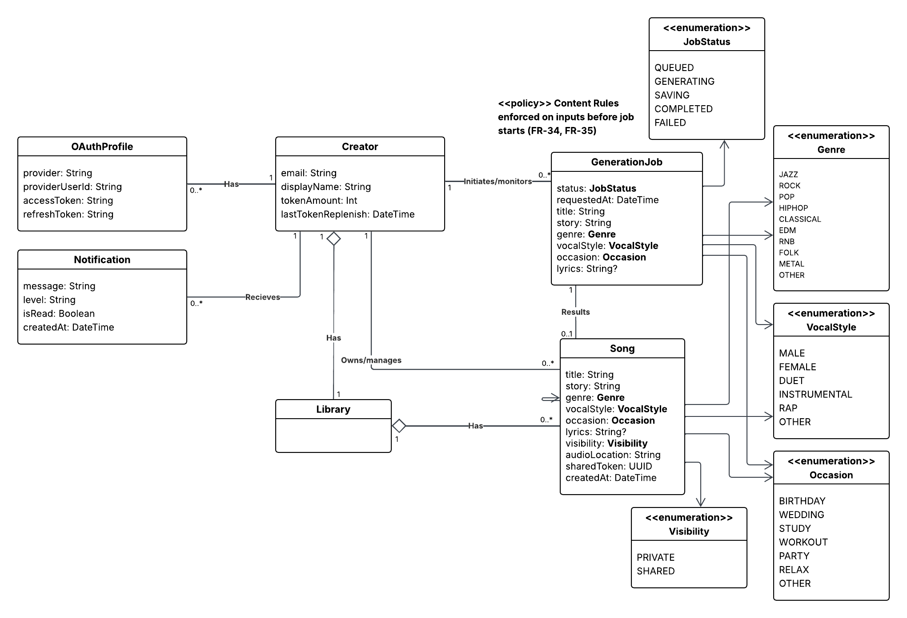
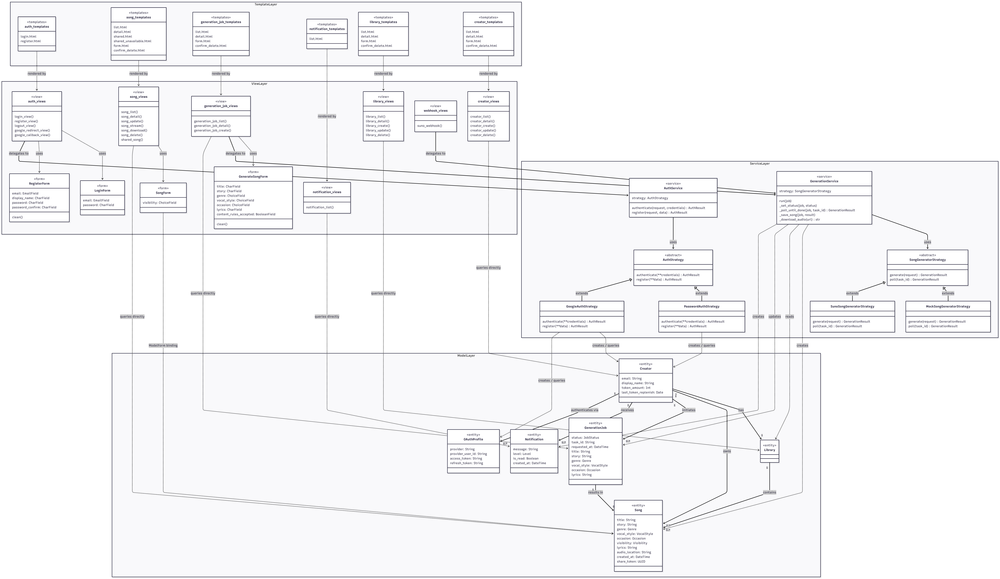

# Music Generation App

A Django-based domain layer implementation for a music generation platform. This project models the core domain entities including Creators, Songs, Libraries, and Generation Jobs.

---

## Requirements

- Python 3.10+
- pip

---

## Setup Instructions

### 1. Clone the repository

```bash
git clone https://github.com/Papustarung/music-generation.git
cd music_generation
```

### 2. Create and activate a virtual environment

```bash
python -m venv venv
```

**Windows:**
```bash
venv\Scripts\activate
```

**macOS/Linux:**
```bash
source venv/bin/activate
```

### 3. Install dependencies

```bash
pip install -r requirements.txt
```

### 4. Apply database migrations

```bash
python manage.py migrate
```

### 5. Create a superuser (for Django Admin access)

```bash
python manage.py createsuperuser
```

Follow the prompts to set a username, email, and password.

### 6. Run the development server

```bash
python manage.py runserver
```

The application will be available at `http://127.0.0.1:8000/`.

---

## CRUD Operations (For exercise 3 only)

### HTML Interface (Function-Based Views)

Full CRUD is available via plain HTML pages at the following URLs. No login required in development.

| Entity | List | Create | Detail | Edit | Delete |
|---|---|---|---|---|---|
| **Creator** | `/creators/` | `/creators/create/` | `/creators/<id>/` | `/creators/<id>/edit/` | `/creators/<id>/delete/` |
| **Library** | `/libraries/` | `/libraries/create/` | `/libraries/<id>/` | `/libraries/<id>/edit/` | `/libraries/<id>/delete/` |
| **Song** | `/songs/` | `/songs/create/` | `/songs/<id>/` | `/songs/<id>/edit/` | `/songs/<id>/delete/` |
| **Generation Job** | `/jobs/` | `/jobs/create/` | `/jobs/<id>/` | `/jobs/<id>/edit/` | `/jobs/<id>/delete/` |

Visiting `http://127.0.0.1:8000/` redirects to `/creators/`. A navigation bar links to all four entity lists.

**Recommended creation order** (to satisfy foreign-key constraints):
1. Create a **Creator**
2. Create a **Library** — select the Creator created above
3. Create a **Song** — select the Library created above
4. Create a **Generation Job** — select a Creator (and optionally a Song)

[CRUD functionality demo (API)](https://youtu.be/H5vxge5HoOg)

### Django Admin Interface

1. Start the server and navigate to `http://127.0.0.1:8000/admin/`
2. Log in with the superuser credentials created above
3. The following models are available for full Create, Read, Update, and Delete operations:

| Model | Description |
|---|---|
| **Creator** | Platform users with email, display name, and token balance |
| **Library** | Personal song library belonging to each Creator |
| **Song** | Songs stored in a Library, with genre, vocal style, occasion, and visibility |
| **Generation Job** | Music generation requests submitted by a Creator |

[CRUD functionality demo (Admin)](https://youtu.be/h37pt2xlssQ)

---

## Song Generation — Strategy Pattern

Generation is implemented using the **Strategy** design pattern, allowing the AI backend to be swapped without changing the rest of the application.

### Architecture

```
SongGeneratorStrategy (abstract base — base.py)
├── MockSongGeneratorStrategy   (mock_strategy.py)   ← no network, instant result
└── SunoSongGeneratorStrategy   (suno_strategy.py)   ← calls api.sunoapi.org

SongGeneratorFactory (factory.py)  ← reads GENERATOR_STRATEGY from .env
GenerationService   (service.py)   ← orchestrates the full job lifecycle
```

| File | Role |
|---|---|
| `core/generation/strategies/base.py` | `SongGeneratorStrategy` ABC + `GenerationRequest` / `GenerationResult` dataclasses |
| `core/generation/strategies/mock_strategy.py` | Returns a static MP3 instantly — no API key required |
| `core/generation/strategies/suno_strategy.py` | POSTs to Suno API, receives webhook callback, parses clips |
| `core/generation/factory.py` | Reads `GENERATOR_STRATEGY` env var and returns the right strategy |
| `core/generation/service.py` | Runs the full QUEUED → GENERATING → SAVING → COMPLETED lifecycle |

---

### Running in Mock Mode

Mock mode requires no API key and completes instantly.

**1. Set environment variable**

In your `.env` file:
```
GENERATOR_STRATEGY = mock
```

**2. Start the server**
```bash
python manage.py runserver
```

**3. Generate a song**

Go to `http://127.0.0.1:8000/jobs/create/`, fill in the form, and submit.  
The job will complete immediately and the song will appear in your library with a static placeholder audio file.

**Example log output (mock):**
```
INFO Suno webhook: callbackType=... (not called in mock mode)
# Job transitions: QUEUED → GENERATING → SAVING → COMPLETED
```

---

### Running in Suno Mode

**1. Obtain a Suno API key**

Register at [api.sunoapi.org](https://api.sunoapi.org) and copy your API key.

**2. Configure `.env`**

```
GENERATOR_STRATEGY = suno
SUNO_API_KEY = <your-key-here>
SUNO_CALLBACK_URL = https://<your-ngrok-subdomain>.ngrok-free.app/jobs/webhook/suno/
```

> **Never commit your `.env` file.** It is excluded by `.gitignore`.  
> Use `.env.example` as a safe template to share with collaborators.

**3. Expose localhost with ngrok** (required for Suno's callback)

```bash
ngrok http 8000
```

Copy the ngrok forwarding URL and append `/jobs/webhook/suno/`, e.g. `https://xxxx.ngrok-free.app/jobs/webhook/suno/`, into `SUNO_CALLBACK_URL` in `.env`.

**4. Start the server**
```bash
python manage.py runserver
```

**5. Generate a song**

Go to `/jobs/create/`, fill in the form, and submit.  
The job starts asynchronously. Status updates every 5 seconds on the detail page.

**Example log output (Suno):**
```
INFO Suno webhook: callbackType=text job=5
INFO Suno webhook: callbackType=first job=5
INFO Suno webhook: callbackType=complete job=5
INFO Suno webhook: job=5 audio_url=https://tempfile.aiquickdraw.com/r/....mp3
INFO Suno webhook: job 5 completed successfully
```

---

## Domain Model



The domain layer consists of the following entities and enumerations:

### Entities

| Entity | Key Attributes | Relationships |
|---|---|---|
| **Creator** | `email`, `displayName`, `tokenAmount`, `lastTokenReplenish` | Has 1 Library; owns 0..* Songs; initiates 0..* GenerationJobs; receives 0..* Notifications; has 0..* OAuthProfiles |
| **Library** | — | Belongs to 1 Creator; contains 0..* Songs |
| **Song** | `title`, `story`, `genre`, `vocalStyle`, `occasion`, `lyrics`?, `visibility`, `audioLocation`, `sharedToken`, `createdAt` | Belongs to a Library; optionally produced by 1 GenerationJob |
| **GenerationJob** | `status`, `requestedAt`, `taskId`, `title`, `story`, `genre`, `vocalStyle`, `occasion`, `lyrics`? | Linked to 1 Creator; results in 0..1 Song |
| **Notification** | `message`, `level`, `isRead`, `createdAt` | Received by 1 Creator |
| **OAuthProfile** | `provider`, `providerUserId`, `accessToken`, `refreshToken` | Belongs to 1 Creator |

### Enumerations

- **Genre**: JAZZ, ROCK, POP, HIPHOP, CLASSICAL, EDM, RNB, FOLK, METAL, OTHER
- **VocalStyle**: MALE, FEMALE, DUET, INSTRUMENTAL, RAP, OTHER
- **Occasion**: BIRTHDAY, WEDDING, STUDY, WORKOUT, PARTY, RELAX, OTHER
- **Visibility**: PRIVATE, SHARED
- **JobStatus**: QUEUED, GENERATING, SAVING, COMPLETED, FAILED

---

## Project Structure

```
music_generation/
├── manage.py
├── db.sqlite3
├── requirements.txt
├── diagram/
│   ├── domain_model/           # Domain model diagram (PNG, PDF, Lucidchart JSON)
│   └── class_diagram/          # Architecture class diagram (PNG, PDF, Mermaid source)
├── media/
│   └── songs/                  # Generated audio files (served at /media/)
├── music_generation/           # Django project settings
│   ├── settings.py
│   ├── urls.py
│   ├── asgi.py
│   └── wsgi.py
└── core/                       # Main application
    ├── admin.py
    ├── forms.py                # ModelForms for Song, GenerationJob, Creator
    ├── urls.py
    ├── context_processors.py   # Injects unread notification count into all templates
    ├── notifications.py        # Helper to create Notification records
    ├── tokens.py               # Token balance logic (replenish, deduct, check)
    ├── auth/                   # Authentication module (Strategy pattern)
    │   ├── backends.py         # Custom Django auth backend (email login)
    │   ├── factory.py          # AuthStrategyFactory
    │   ├── service.py          # AuthService — login/register orchestration
    │   └── strategies/
    │       ├── base.py         # AuthStrategy ABC
    │       ├── password_strategy.py
    │       └── google_strategy.py
    ├── generation/             # Music generation module (Strategy pattern)
    │   ├── factory.py          # SongGeneratorFactory
    │   ├── service.py          # GenerationService — full job lifecycle
    │   └── strategies/
    │       ├── base.py         # SongGeneratorStrategy ABC
    │       ├── mock_strategy.py
    │       └── suno_strategy.py
    ├── models/
    │   ├── entities/
    │   │   ├── creator.py
    │   │   ├── library.py
    │   │   ├── song.py
    │   │   ├── generation_job.py
    │   │   ├── notification.py
    │   │   └── oauth_profile.py
    │   └── enum/
    │       ├── genre.py
    │       ├── vocal_style.py
    │       ├── occasion.py
    │       ├── visibility.py
    │       └── job_status.py
    ├── views/
    │   ├── auth_views.py           # Register, login, logout, Google OAuth
    │   ├── home_view.py
    │   ├── creator_views.py
    │   ├── library_views.py
    │   ├── song_views.py           # Song CRUD + stream + shared link
    │   ├── generation_job_views.py # Job create/detail + background thread
    │   ├── notification_views.py
    │   └── webhook_views.py        # Suno callback endpoint
    ├── templates/
    │   ├── home.html
    │   ├── auth/
    │   │   ├── login.html
    │   │   └── register.html
    │   ├── core/
    │   │   └── base.html           # Shared base with navigation
    │   ├── creator/                # list, detail, form, confirm_delete
    │   ├── library/
    │   ├── song/                   # + shared.html, shared_unavailable.html
    │   ├── generation_job/
    │   └── notification/
    └── migrations/
```

---

## Architecture — Class Diagram

The application follows Django's **MVT (Model–View–Template)** architecture, with a Service layer sitting between Views and Models to keep business logic out of both.

> **Note — diagram density:** The Mermaid source (`diagram/class_diagram/class_diagram_mermaid`) contains 20 classes across 4 namespaces connected by ~39 labelled arrows (Template→View, View→Form, View→Service, View→Model, Form→Model, Service→Strategy, Strategy→Model, Service→Model, and Model↔Model relationships). When rendered in an online editor this produces a dense "cobweb" layout that forces all text to a very small size. The exported PNG (`diagram/class_diagram/class_diagram.png`) and PDF are the recommended way to read the diagram at full resolution.



### Layers

| Layer | Components | Responsibility |
|---|---|---|
| **Template** | HTML templates (`base.html`, per-entity templates) | Rendered by Views; presents data to the user |
| **View** | `*_views.py`, `forms.py` | Handles HTTP request/response; delegates business logic to Services |
| **Service** | `AuthService`, `GenerationService`, Strategy classes | Orchestrates domain operations; applies Strategy pattern for auth and generation |
| **Model** | `Creator`, `Library`, `Song`, `GenerationJob`, `Notification`, `OAuthProfile` | Persistent domain entities; mapped to the database via Django ORM |

### Design Patterns

- **Strategy** — `AuthService` / `GenerationService` each depend on an abstract strategy interface. Concrete strategies (`PasswordAuthStrategy`, `GoogleAuthStrategy`, `MockSongGeneratorStrategy`, `SunoSongGeneratorStrategy`) are selected at runtime via a Factory.
- **Factory** — `AuthStrategyFactory` and `SongGeneratorFactory` read environment variables to instantiate the correct strategy.
- **Observer (Signal)** — A Django `post_save` signal on `Creator` automatically creates the associated `Library`.

---

## Sequence Diagram — UC-2: Generate a Song

> **Note — diagram density:** The Mermaid source (`diagram/sequence_diagram/uc2_song_generation`) spans 11 participants and 4 phases across two concurrent threads. When rendered in an online editor this produces a wide, heavily annotated diagram that forces all text to a very small size. The exported PNG (`diagram/sequence_diagram/uc2_song_generation.png`) and PDF are the recommended way to read the diagram at full resolution.


The diagram covers the full song generation lifecycle across four phases:

1. **HTTP request** — Creator submits the generation form; `generation_job_views` validates input, checks token balance, creates the `GenerationJob` (status `QUEUED`), deducts a token, spawns a background thread, and immediately returns a redirect — the browser never waits for generation to finish (FR-09).
2. **Background thread** — `GenerationService` drives the job through `GENERATING`; `SunoSongGeneratorStrategy` calls the Suno API and polls for completion every 5 seconds (up to 10 minutes), exiting early if the webhook wins the race.
3. **Suno webhook callback** — Suno fires a `POST` to `webhook_views`; the view spawns its own completion thread and returns `200 OK` immediately.
4. **Webhook completion thread** — status set to `SAVING`; `GenerationService._save_song()` downloads the audio to local disk, creates the `Song` record linked to the creator's `Library`, sets status to `COMPLETED`, and sends a success `Notification`.
